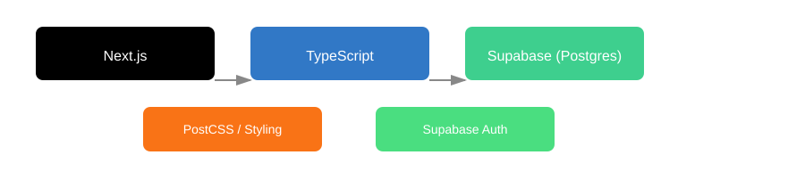
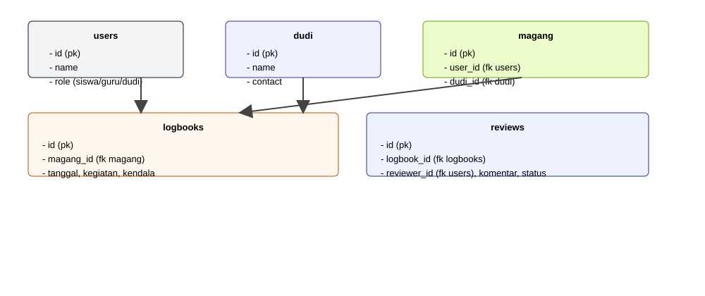

**Ringkasan**

Proyek ini adalah aplikasi web untuk manajemen magang yang dibangun dengan kerangka kerja Next.js dan TypeScript. Aplikasi menyediakan fitur otentikasi, dashboard untuk peran berbeda (siswa, guru, dudi), manajemen logbook, dan proses review serta pengumpulan laporan magang.

**Bahasa & Teknologi**

- **Bahasa Pemrograman:** TypeScript
- **Framework:** Next.js (App Router)
- **Backend / Database:** Supabase (PostgreSQL)
- **Styling / Build:** PostCSS
- **Linting & Config:** ESLint, tsconfig

**Tujuan Proyek**

- **Tujuan utama:** Menyediakan platform untuk memfasilitasi proses magang, meliputi pendaftaran, pencatatan logbook, review oleh pembimbing, dan pelaporan akhir.
- **Pengguna target:** Siswa magang, guru/pembimbing, dan pihak DUDI (industri mitra).

**Tech Stack**

Berikut ilustrasi arsitektur/tech stack yang digunakan oleh proyek ini:



**Diagram Database (Ringkas)**

Diagram berikut menunjukkan tabel inti yang direkomendasikan berdasarkan rute API dan fitur yang terlihat di kode sumber:



**Cara Menjalankan (Singkat)**

- **Instalasi dependencies:** `npm install`
- **Menjalankan dev server:** `npm run dev`
- **Environment:** Pastikan variabel Supabase (URL & Key) tersedia di `.env.local` atau di pengaturan hosting.

**Struktur Utama (Singkat)**

- **API routes:** `src/app/api/*` — endpoint untuk auth, dashboard, dudi, logbook, magang
- **Komponen & Layout:** `src/components`, `src/app/*` — halaman dan layout per role
- **Lib auth & supabase:** `src/lib/auth`, `src/lib/supabase`

Jika Anda mau, saya bisa menambahkan penjelasan lebih rinci tiap endpoint, atau menghasilkan file ERD PNG/SVG lebih detil untuk dokumentasi.
This is a [Next.js](https://nextjs.org) project bootstrapped with [`create-next-app`](https://nextjs.org/docs/app/api-reference/cli/create-next-app).

## Getting Started

First, run the development server:

```bash
npm run dev
# or
yarn dev
# or
pnpm dev
# or
bun dev
```

Open [http://localhost:3000](http://localhost:3000) with your browser to see the result.

You can start editing the page by modifying `app/page.tsx`. The page auto-updates as you edit the file.

This project uses [`next/font`](https://nextjs.org/docs/app/building-your-application/optimizing/fonts) to automatically optimize and load [Geist](https://vercel.com/font), a new font family for Vercel.

## Learn More

To learn more about Next.js, take a look at the following resources:

- [Next.js Documentation](https://nextjs.org/docs) - learn about Next.js features and API.
- [Learn Next.js](https://nextjs.org/learn) - an interactive Next.js tutorial.

You can check out [the Next.js GitHub repository](https://github.com/vercel/next.js) - your feedback and contributions are welcome!

## Deploy on Vercel

The easiest way to deploy your Next.js app is to use the [Vercel Platform](https://vercel.com/new?utm_medium=default-template&filter=next.js&utm_source=create-next-app&utm_campaign=create-next-app-readme) from the creators of Next.js.

Check out our [Next.js deployment documentation](https://nextjs.org/docs/app/building-your-application/deploying) for more details.
